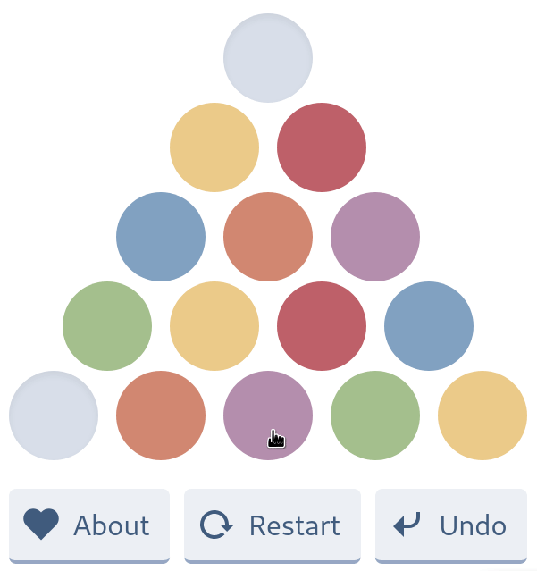

# Triangles.fun

A colorful, relaxing HTML5 puzzle game. Play at <https://triangles.fun>

Consider donating on
[Buy Me a Coffee](https://www.buymeacoffee.com/peterbabic) to sustain
domain costs.



## Technologies used

- [Svelte](https://svelte.dev/)
- [TailwindCSS](https://tailwindcss.com/)
- [PWA](https://developer.mozilla.org/en-US/docs/Web/Progressive_web_apps)
- [NORD theme](https://www.nordtheme.com/docs/colors-and-palettes)

## Inspiration

Thanks for my girlfriend Sara for showing me the IRL version, she played it
when she was a little kid. The photo of IRL triangles for the interested in
in my humble blog hosted on this domain (currently running Sapper, so no
Tailwind there yet).

Thanks also to Carlos Ferreira for the https://squares.fun for showing me
this tech stack is possible and works nicely together. Since I have found
Squares, I wanted to do such project. Now it is a reality. Go play a
version Carlos made too it, it's a lot of fun.

## Development

You can clone this repo and run the code yourself. Standard Svelte run
commands apply.

```bash
npm run build && npm run start
## OR
npm run dev
```

Now navigate to <https://localhost:5000>

## Testing

A test run can be invoked via Cypress.

```bash
npx cypress run
# OR
npx cypress open
```

The game must be running in a different terminal before that. It requires
the server running beforehand, you can utilize
[start-server-and-test](https://www.npmjs.com/package/start-server-and-test)
to overcome this. Practices vary.

Please note that there is a problem of clicking to multiple elements, that
I did not find a solution to yet, that happes during test.

## TODO

- [x] ad
- [x] update icons
- [x] manage UI buttons
- [x] fix undo missing animation
- [x] fix undo when circle picked
- [x] add about page
- [x] fix victory / gameover modal
- [x] handle U, R and A keypresses
- [ ] polish the `App.svelte`, it is too large
- [ ] fix the problem of top row getting out of the screen

## License

All source code is licensed under MIT.
